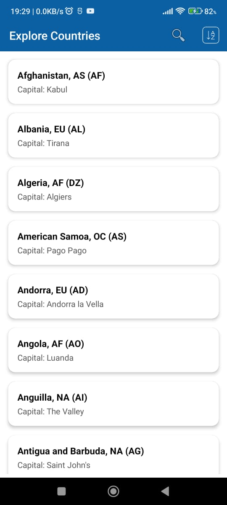
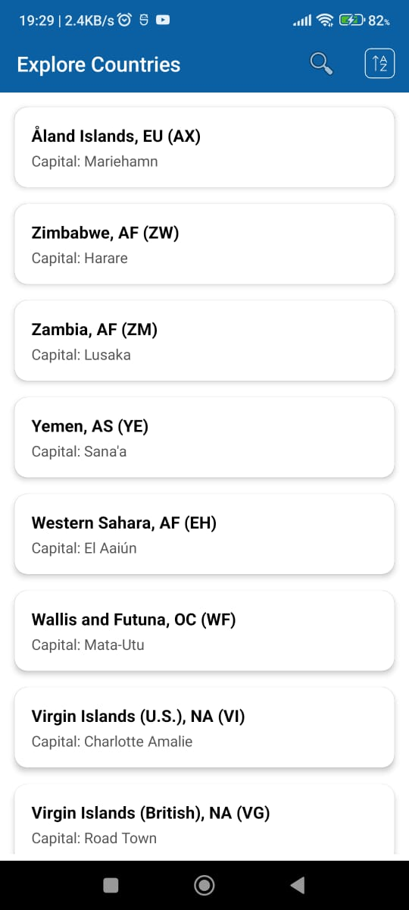
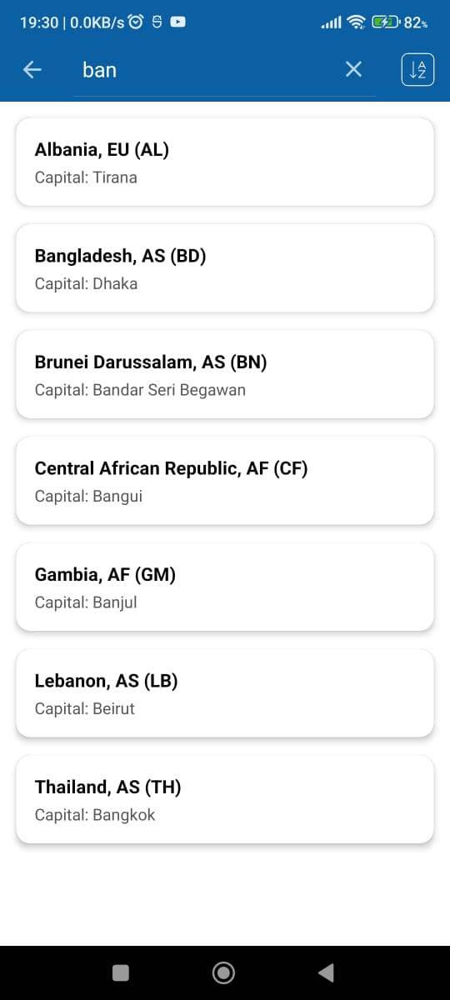

# Country Explorer Android App

An Android application that fetches and displays a list of countries from a REST API, with search and sorting functionality using MVVM, Hilt for dependency injection, and Jetpack components.

---

## Features

- 🌐 Fetches a list of countries from an online JSON API.
- 🔍 Real-time **search** by country name, capital, region, or country code.
- ↕️ **Sorting** functionality (A-Z or Z-A by country name).
- 📡 Handles **no internet connection** gracefully with retry option.
- ✅ Follows **MVVM architecture**.
- ⚙️ Utilizes **Hilt** for dependency injection.
- 🔄 Uses Kotlin Coroutines + Flow for asynchronous data handling.

---

## Screenshots

 <table>
 <tr>
     <td>List Sorted by Name</td>
     <td>List Sorted by Name (descending)</td>
     <td>Search Result</td>
   
  </tr>

 <tr>
    <td></td>
    <td></td>
  <td></td>
  </tr>
 </table>

---

## Architecture

**MVVM + Repository Pattern** with the following components:

- **UI Layer** (MainActivity)
- **ViewModel Layer** (MainViewModel)
- **Data Layer** (CountryRepository)
- **Model** (Country data class)

---

## Tech Stack

- **Language**: Kotlin
- **Architecture**: MVVM
- **Dependency Injection**: Hilt
- **Networking**: Retrofit
- **Asynchronous**: Kotlin Coroutines + Flow
- **View Binding**: Enabled
- **RecyclerView**: With `ListAdapter` and `DiffUtil` for efficient list updates

---

## Setup Instructions

1. Clone the repository:
```bash
git clone https://github.com/ShimantaMutsuddi/CountryExplorer.git
```

2. Open in Android Studio.

3. Make sure you have internet permissions in `AndroidManifest.xml`:
```xml
<uses-permission android:name="android.permission.INTERNET" />
```

4. Build and run the app on an emulator or physical device.

---


## Functionality Breakdown

### 🔹 MainActivity.kt
- Sets up UI using ViewBinding.
- Observes `countries` `StateFlow` from `MainViewModel`.
- Displays loading spinner, list, and error messages.
- Supports menu options for search and sorting.
- Handles internet connection state.

### 🔹 MainViewModel.kt
- Fetches countries from the repository.
- Stores unfiltered list.
- Supports filtering based on search input.
- Supports sorting by country name (asc/desc).
- Exposes `StateFlow<Resource<List<Country>>>` to the UI.

### 🔹 CountryRepository.kt
- Makes API call using Retrofit.
- Wraps response in `Resource` sealed class for success/error/loading state.

### 🔹 CountryAdapter.kt
- Displays country data (name, capital, region, code).
- Inherits from `ListAdapter` and utilizes `DiffUtil.ItemCallback` to compute minimal changes between lists, enabling smooth UI updates without reloading the whole list.

### 🔹 Resource.kt
A sealed class representing `Loading`, `Success`, and `Error` states.

---

## How It Works

1. **App Launches** → Checks internet → Fetches country list.
2. **Search Input** → Filters the current country list.
3. **Sort Option Clicked** → Toggles ascending/descending order.
4. **No Internet** → Shows retry button and animation.

---

## To Do

- [ ] Unit tests for ViewModel and Repository

---
